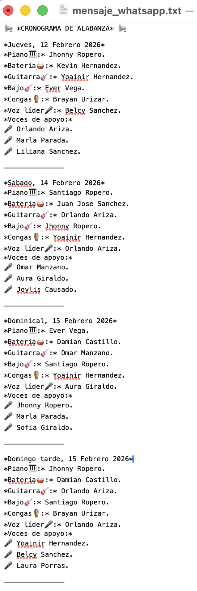
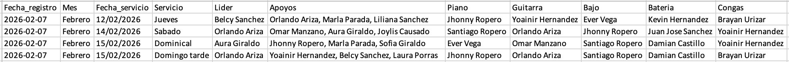

# 🎹 Gestor automatizado de cronogramas de alabanza

> **Un sistema ETL automatizado para la gestión, rotación y asignación inteligente de músicos, construido con Python y Pandas.**

  

## 📖 Descripción del proyecto

Este proyecto nació de la necesidad de optimizar la gestión de un equipo de alabanza de más de 20 integrantes. La asignación manual generaba errores humanos, repetición de músicos y falta de trazabilidad histórica.

El sistema actúa como un **Asistente inteligente** que:
1.  **Extrae (Extract):** Lee la disponibilidad y roles desde un archivo Excel.
2.  **Transforma (Transform):** Aplica reglas de negocio (descansos, equidad, rotación) y valida las entradas mediante lógica difusa.
3.  **Carga (Load):** Actualiza el histórico maestro y genera notificaciones automáticas.
4.  **Analiza (Analyze):** Genera reportes visuales sobre la participación del equipo.

## 🚀 Características principales

* **🔄 Lógica de rotación inteligente:** Algoritmo que asegura que los líderes no repitan consecutivamente y que los músicos tengan periodos de descanso adecuados.
* **🛡️ Algoritmo de "rescate" (plan B):** Lógica de *fallback* que relaja restricciones automáticamente si no hay candidatos disponibles para garantizar el servicio.
* **💾 Persistencia de Datos:**  Uso de archivos JSON para dotar al programa de "memoria", permitiéndole recordar quién tocó la semana pasada para tomar decisiones futuras.
* **📊 Integridad de datos:** Sistema de validación de duplicados que detecta si un cronograma ya existe en el Histórico Maestro, ofreciendo opciones de sobrescritura o preservación de datos.
* **🧠 Validación inteligente (Fuzzy Matching):** Interfaz que utiliza `difflib` para sugerir correcciones si el usuario comete errores al escribir roles o meses.
* **📊 Dashboard de análisis:** Visualización de estadísticas de participación mediante gráficas generadas con **Matplotlib**.
* **📱 Automatización de salidas:** Generación de enlaces directos para WhatsApp.

## 🛠️ Tecnologías Utilizadas

* **Python:** Lenguaje base del proyecto.
* **Pandas:** Manipulación de DataFrames, limpieza de datos, operaciones ETL (Extract, Transform, Load) y lógica de filtrado.
* **Matplotlib:** Generación de gráficas estadísticas.
* **Difflib & Unicodedata:** Motor de sugerencias y normalización de texto (limpieza de tildes).
* **OpenPyXL:** Motor de escritura para archivos Excel.
* **JSON:** Manejo de "memoria" del programa (estados anteriores).
* **OS/Sys:** Automatización de tareas del sistema operativo.

## 📂 Estructura del Proyecto

El código sigue una arquitectura modular para facilitar el mantenimiento y la escalabilidad:

```bash
📁 Worship-Scheduler/
│
├── 📁 src/
│   ├── main.py          # Punto de entrada y orquestador.
│   ├── scheduler.py     # Algoritmos de asignación y reglas de negocio.
│   ├── database.py      # Capa de datos (Excel, JSON, WhatsApp).
│   ├── analisis.py      # Procesamiento de métricas y gráficas.
│   └── interface.py     # Interfaz de consola y validación inteligente.
│
├── 📁 data/
│   ├── 📁 input/        # Fuente: integrantes.xlsx.
│   └── 📁 output/       # Resultados: Cronograma_Maestro.xlsx y reportes.
│
└── README.md            # Documentación.
```

## 📊 Diccionario de Datos (Estructura de `integrantes.xlsx`)

Para que el algoritmo de asignación y la carga de datos funcionen correctamente, el archivo Excel de entrada debe contar con las siguientes columnas exactas:

| Columna | Descripción |
| :--- | :--- |
| **Lideres** | Cantantes capacitados para dirigir la alabanza. |
| **Voces** | Cantantes principales asignados para el servicio. |
| **Apoyo** | Voces de acompañamiento y coros. |
| **Piano** | Músicos encargados del teclado/piano. |
| **Bajo** | Músicos encargados del bajo eléctrico. |
| **Bateria** | Músicos encargados de la batería. |
| **Congas** | Músicos encargados de la percusión (Congas/Bongós). |
| **Guitarra** | Músicos encargados de la guitarra (Acústica/Eléctrica). |

> **Nota:** El programa ignora las celdas vacías y limpia automáticamente los espacios en blanco al inicio o al final de los nombres.

## 🖼️ Vista Previa del Resultado

Al ejecutar el sistema, se genera automáticamente un mensaje con formato profesional para WhatsApp y se actualiza la bitácora en Excel:

| Notificación de WhatsApp | Historial Maestro (Excel) |
| :---: | :---: |
|  |  |

> **Nota:** Las imágenes de arriba son ejemplos del formato de salida generado por el script.

El sistema genera un mensaje formateado listo para ser enviado por redes sociales:

> 📢 **CRONOGRAMA DE ALABANZA** 📢
>
> **Jueves, 12 Febrero 2026**
> *Piano🎹:* Juan Pérez.
> *Bateria🥁:* Andrés López.
> ... (etc)

## 🧠 Lógica de negocio y algoritmos

El "cerebro" del proyecto se encuentra en la interacción entre `scheduler.py`, `interface.py` y `database.py`. El sistema no solo asigna nombres, sino que razona basándose en reglas de convivencia y disponibilidad.

### 🔍 Validación inteligente (Fuzzy Logic)
Para evitar que el programa falle por errores de escritura (typos) o diferencias en tildes, implementamos una función de validación universal:
1.  **Normalización:** Se eliminan marcas diacríticas y se estandariza a minúsculas mediante `unicodedata`.
2.  **Mapeo Dinámico:** Se construye un "traductor" (diccionario) que vincula la entrada simplificada del usuario con la columna exacta de la base de datos.
3.  **Sugerencias:** Si la entrada no es exacta, el sistema utiliza el algoritmo de *Gestalt Pattern Matching* (`difflib`) para ofrecer la opción más probable (ej: "¿Quisiste decir 'Batería'?").

### 🛡️ Protección de integridad (SSOT)
En el módulo `database.py`, se implementó una lógica de protección de datos para que el *histórico maestro* sea siempre la "única fuente de verdad" (Single Source of Truth):
* **Detección de Conflictos:** El sistema compara las fechas nuevas con las existentes mediante `.isin()`.
* **Intervención Humana:** Ante un duplicado, el programa detiene la ejecución y solicita una decisión: ¿Sobrescribir datos, Posponer la carga o Cancelar el proceso?

### 🔄 Lógica de rotación y rescate
* **Descansos automáticos:** El algoritmo excluye a los músicos que participaron en el servicio anterior.
* **Algoritmo de fallback:** Si los filtros estrictos (descanso + disponibilidad) dejan un puesto vacío, el sistema activa un modo de "rescate" que relaja las restricciones para asegurar que el cronograma siempre se complete.

## 🔧 Instalación y Uso

1.  **Clonar el repositorio:**
    ```bash
    git clone (https://github.com/tu-usuario/worship-scheduler.git)
    ```

2.  **Instalar dependencias:**
    ```bash
    pip install -r requirements.txt
    ```

3.  **Configurar datos:**
    Coloca tu archivo `integrantes.xlsx` en la carpeta `data/input/`.

4.  **Ejecutar:**
    ```bash
    python src/main.py
    ```

## 📈 Próximos Pasos (Roadmap)

- [x] Implementar dashboard de análisis con **Matplotlib** para visualizar estadísticas.
- [x] Interfaz de validación inteligente de entradas (Fuzzy matching).
- [ ] Migrar la persistencia de datos de Excel a una base de datos **SQLite**.
- [ ] Desarrollar una interfaz gráfica (GUI) con **CustomTkinter**.

## 👤 Autor

**Josué Gabriel Giraldo Suárez**

---
*Desarrollado con pasión por la música y los datos.* 🎶👨‍💻